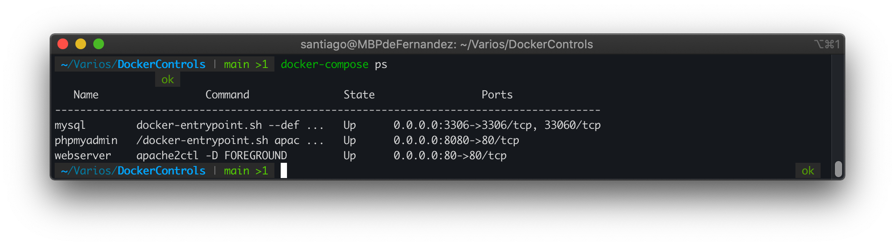
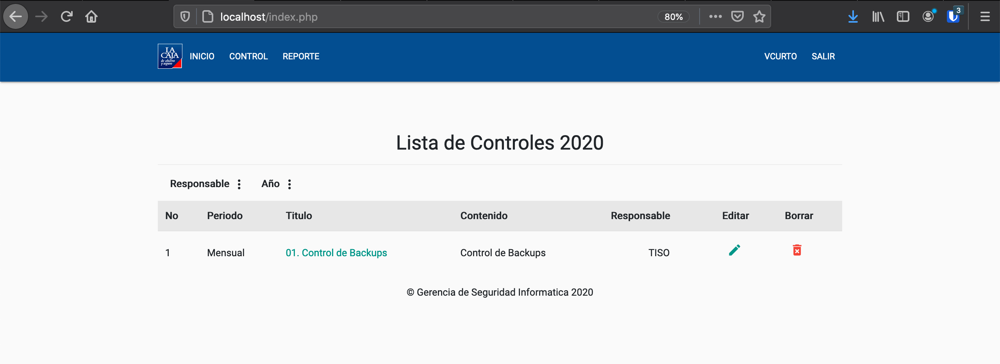
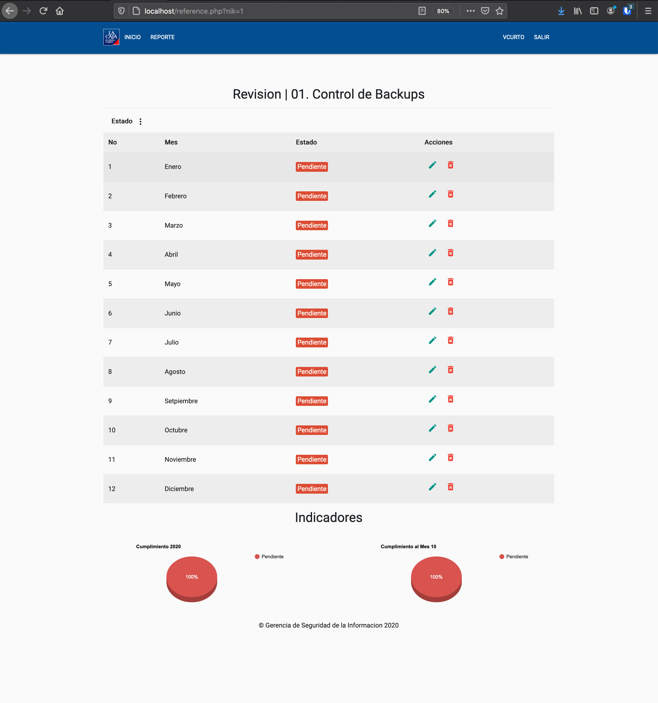

# Controls Dockerized

This project is on my **Github**. The only thing that changes is that I have Dockerized it.

## Getting Started 🚀 

### Requirements 📋

It is important to have installed Docker.oi & docker-compose.

### Install 🔧

_Clon the Proyect_

```
https://github.com/safernandez666/ControlsDockerized.git
```
_Configure the LDAP Server in login.php & add the Group to the AD User_

```
$host = '192.168.0.190';
$domain = 'ironbox.local';
$basedn = 'dc=ironbox,dc=local';
$group = 'Grupo_Controls';
```
_Windows AD Config_


_Inside the folder_

```
docker-compose up -d --build

```
Then to find out if the containers are running, you can run this command and you will see the Docker's

```
docker-compose ps

```


Now you can enjoy the Application on http://localhost.





If you want to set emails, you can configure /envios/enviar.py and croned in the Dockerfile.

## Disclaimer

I am not a developer, this MVP was made a long time ago. Know how to excuse that code & harcoding. 🤪
